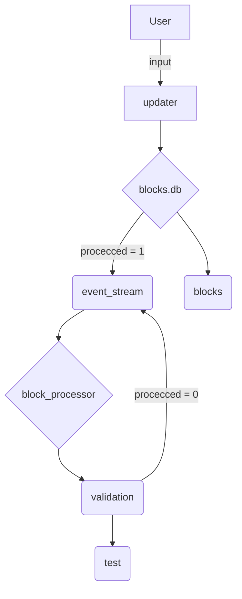

## Блок-процесор з SQL бек-ендом

Даний проєкт є системою обробки блоків та голосів та створення ланцюжка блоків. Він прогресує від аналізу CSV-файлу зі вхідною інформацією до роботи з базою данних(`SQLite`), залучення користувача до безпосереднього вводу інформації під час роботи системи, а також застосування типізація та валідації отриманих данних(`Pydantic`) та тестування роботи усього процесу(`Pytest`).

## Структура проєкту (опис лабораторних робіт)

* **Лабораторна 2 (`lab2.py`): блок-процесор із введенням з CSV-файлу** — створення базової логіки зчитування інформації з CSV-файлу, фільтрація блоків та голосів із використанням класової архітектури(`@dataclass`), а також побудова послідовного ланцюжка блоків.
* **Лабораторні 3 та 4 (`labs3and4.py`): створення та наповнення бази данних** — перехід до збереження даних у базу данних `blocks.db`, що має таблиці `blocks`, `sources`, `votes`, `persons` та використовує класову архітектуру з Лабораторної 2.
* **Лабораторна 5: автоматичний процесор** — розділення системи на два незалежні компоненти:
    * `updater.py` — програма, який приймає нові блоки від користувача, записує їх у таблицю `blocks` та створює новий запис у черзі `event_stream`.
    * `block_processor.py` — програма, що працює в нескінченному циклі, обирає по одному необроблені події з `event_stream` (`processed = 1`), обробляє їх та маркує як опрацьовані (`processed = 0`).
* **Лабораторна 6: валідація та тестування коду** — використання `Pydantic` (`BaseModel` - для збереження класової архітектури, `Field` - для валідації атрибутів об'єктів класів) для захисту від некоректних даних (перевірка IP-адрес, hex-форматів ID, обмеження числових значень тощо) та тестування коду за допомогою `Pytest`.

## Блок-схема взаємодії компонентів між собою

